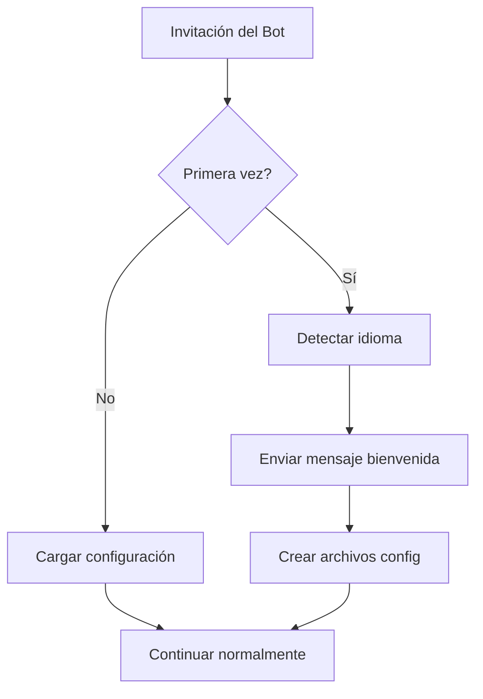
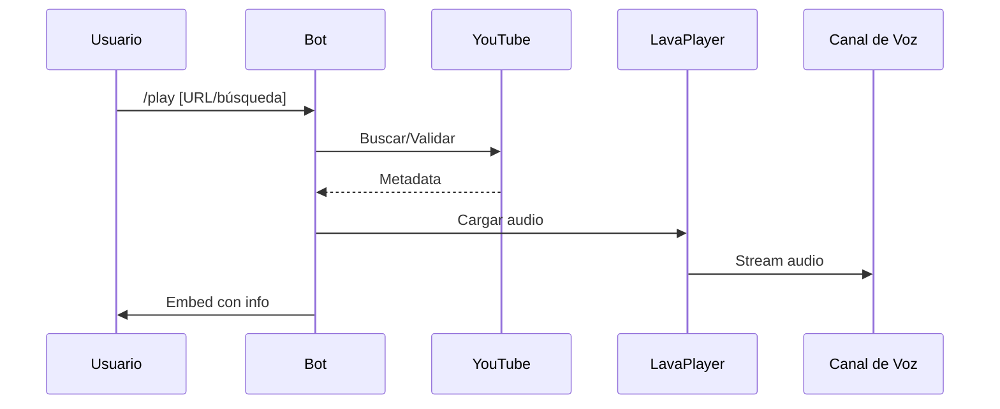

# 🎵 TuneTwister

Bot de música para Discord con sistema multiidioma avanzado y arquitectura moderna.

## 📊 Arquitectura del Sistema



## 🔄 Flujo de Reproducción



## ✨ Características Completas

### 🎵 Sistema de Música
- **Reproducción**
  - YouTube URLs (videos, playlists)
  - Búsqueda por texto
  - Auto-reconexión
  - Control de volumen (0-200%)
  - Sistema anti-crash
  - Buffer adaptativo

- **Cola de Reproducción**
  - Sistema de paginación
  - Persistencia entre reinicios
  - Shuffle
  - Loop (track/queue)
  - Historial de reproducción
  - Previsualización de duración

- **Control de Reproducción**
  ```
  /play    - Reproducir música
  /pause   - Pausar reproducción
  /resume  - Reanudar reproducción
  /stop    - Detener y limpiar cola
  /skip    - Saltar canción actual
  /seek    - Buscar posición específica
  /volume  - Ajustar volumen
  ```

### 🌐 Sistema Multiidioma
- **Idiomas Soportados**
  - 32 idiomas oficiales de Discord
  - 3 idiomas regionales españoles
  - Sistema de fallback inteligente

- **Gestión de Idiomas**
  - Detección automática
  - Persistencia por servidor
  - Cambio en tiempo real
  - Traducciones contextuales

### ⚙️ Sistema de Control
- **Panel de Control**
  ```
  Botones interactivos:
  ▶️ - Reproducir/Reanudar
  ⏸️ - Pausar
  ⏹️ - Detener
  ⏭️ - Siguiente
  🔄 - Loop
  🔀 - Shuffle
  ```

- **Gestión de Permisos**
  - Control por roles
  - Restricciones por canal
  - Comandos administrativos

### 📊 Monitorización
- **Sistema de Logs**
  - Registro detallado
  - Rotación de archivos
  - Niveles de log configurables

- **Diagnósticos**
  ```
  /test    - Ejecutar diagnóstico
  /ping    - Verificar latencia
  /status  - Estado del sistema
  ```

## 🔧 Comandos Detallados

### Sistema de Música
| Comando | Descripción | Opciones |
|---------|-------------|----------|
| `/play` | Reproduce música | `url`, `query`, `playlist` |
| `/search` | Búsqueda avanzada | `query`, `filter`, `limit` |
| `/queue` | Gestiona la cola | `page`, `shuffle`, `clear` |

### Administración
| Comando | Descripción | Permisos |
|---------|-------------|----------|
| `/setup` | Panel de control | ADMIN |
| `/language` | Cambiar idioma | ADMIN |
| `/config` | Configuración | ADMIN |

## 🛠️ Configuración Técnica

### Variables de Entorno
```env
BOT_TOKEN=tu_token
YOUTUBE_API_KEY=tu_api_key
DEFAULT_PREFIX=/
DEFAULT_LANGUAGE=es-ES
```

### Requisitos del Sistema
- Java 21+
- 512MB RAM mínimo
- Permisos Discord:
  - `VIEW_CHANNEL`
  - `SEND_MESSAGES`
  - `EMBED_LINKS`
  - `CONNECT`
  - `SPEAK`

## 📦 Instalación

```bash
git clone https://github.com/raw-community/TuneTwister.git
cd TuneTwister
mvn clean install
java -jar target/TuneTwister.jar
```

## 🤝 Contribuir

1. Fork el repositorio
2. Crea una rama (`git checkout -b feature/mejora`)
3. Commit tus cambios (`git commit -am 'Add: nueva característica'`)
4. Push a la rama (`git push origin feature/mejora`)
5. Abre un Pull Request

## 📜 Licencia

Este proyecto está licenciado bajo MIT - ver el archivo [LICENSE](LICENSE) para más detalles.

## 👥 Créditos

Desarrollado por Raw Community - Jaie55

## 📞 Soporte

- [Discord](https://discord.gg/tuservidor)
- [GitHub Issues](https://github.com/raw-community/TuneTwister/issues)
- [Documentación](https://github.com/raw-community/TuneTwister/wiki)
