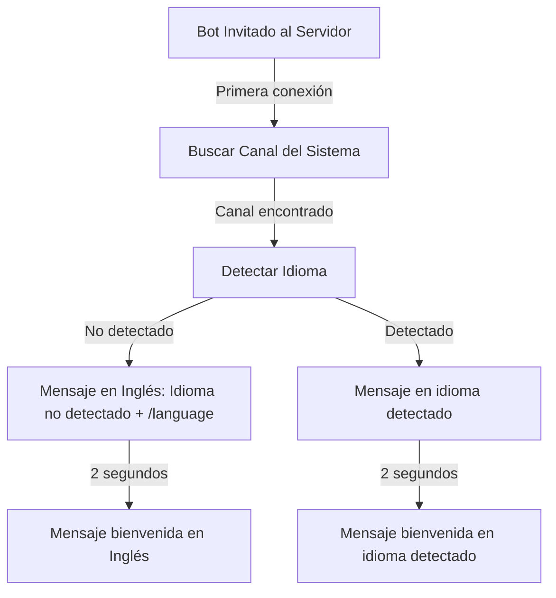
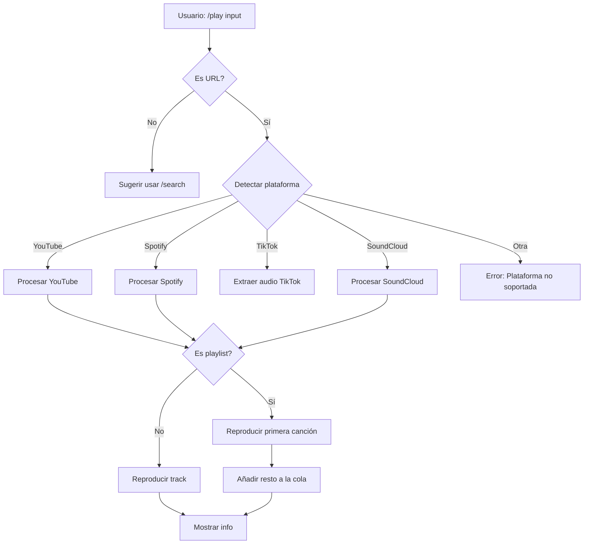
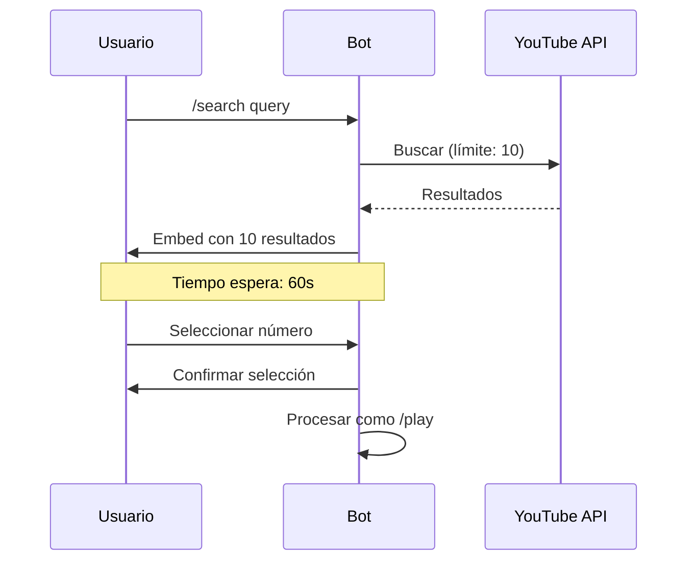
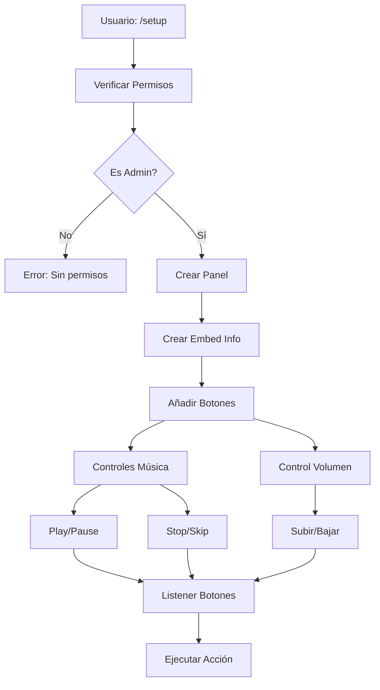

# 🎵 TuneTwister

Bot de música para Discord con sistema multiidioma avanzado y arquitectura moderna.

## 📊 Flujos del Sistema

### Proceso de Inicio


### Comando /play


### Comando /search


### Panel de Control (/setup)


## ✨ Características Completas

### 🎵 Sistema de Música
- **Reproducción**
  - Múltiples plataformas soportadas:
    - YouTube (videos y playlists)
    - Spotify (tracks y playlists)
    - SoundCloud (tracks y playlists)
    - TikTok (audio de videos)
    - Tidal
    - Deezer
  - Control de volumen (0-200%)
  - Auto-reconexión si hay error
  - Sistema anti-crash integrado

- **Búsqueda**
  - Comando `/search` separado
  - Límite: 10 resultados
  - 60 segundos para seleccionar
  - Vista previa de duración
  - Selección por números (1-10)

- **Control de Reproducción**
  ```
  /play    - Reproducir música desde URL de YouTube
  /search  - Buscar y mostrar 10 resultados de YouTube
  /pause   - Pausar reproducción
  /resume  - Reanudar reproducción
  /stop    - Detener y limpiar cola
  /skip    - Saltar canción actual
  /volume  - Ajustar volumen
  ```

### 🌐 Sistema Multiidioma
- **Idiomas Soportados**
  - 32 idiomas oficiales de Discord
  - 3 idiomas regionales españoles
  - Sistema de fallback inteligente

- **Gestión de Idiomas**
  - Detección automática
  - Persistencia por servidor
  - Cambio en tiempo real
  - Traducciones contextuales

### 🌐 Idiomas Disponibles

#### Oficiales de Discord
| Idioma | Código | País/Región |
|--------|--------|-------------|
| English (UK) | en-GB | 🇬🇧 Reino Unido |
| English (US) | en-US | 🇺🇸 Estados Unidos |
| Español | es-ES | 🇪🇸 España |
| Español LATAM | es-419 | 🇲🇽 Latinoamérica |
| Français | fr | 🇫🇷 Francia |
| Deutsch | de | 🇩🇪 Alemania |
| Italiano | it | 🇮🇹 Italia |
| Português (BR) | pt-BR | 🇧🇷 Brasil |
| Polski | pl | 🇵🇱 Polonia |
| Русский | ru | 🇷🇺 Rusia |
| Українська | uk | 🇺🇦 Ucrania |
| Nederlands | nl | 🇳🇱 Países Bajos |
| 日本語 | ja | 🇯🇵 Japón |
| 한국어 | ko | 🇰🇷 Corea del Sur |
| 中文 | zh-CN | 🇨🇳 China |
| 繁體中文 | zh-TW | 🇹🇼 Taiwán |
| Türkçe | tr | 🇹🇷 Turquía |
| Magyar | hu | 🇭🇺 Hungría |
| Čeština | cs | 🇨🇿 República Checa |
| Ελληνικά | el | 🇬🇷 Grecia |
| Dansk | da | 🇩🇰 Dinamarca |
| Română | ro | 🇷🇴 Rumanía |
| Tiếng Việt | vi | 🇻🇳 Vietnam |
| Svenska | sv-SE | 🇸🇪 Suecia |
| ไทย | th | 🇹🇭 Tailandia |
| Bahasa | id | 🇮🇩 Indonesia |
| Hrvatski | hr | 🇭🇷 Croacia |
| български | bg | 🇧🇬 Bulgaria |
| Lietuvių | lt | 🇱🇹 Lituania |
| हिन्दी | hi | 🇮🇳 India |
| Suomi | fi | 🇫🇮 Finlandia |
| Norsk | no | 🇳🇴 Noruega |

#### Regionales de España
| Idioma | Código | Región |
|--------|--------|--------|
| Català | ca-ES | Cataluña |
| Euskara | eu-ES | País Vasco |
| Galego | gl-ES | Galicia |

### ⚙️ Sistema de Control
- **Panel de Control**
  ```
  Botones interactivos:
  ▶️ - Reproducir/Reanudar
  ⏸️ - Pausar
  ⏹️ - Detener
  ⏭️ - Siguiente
  🔄 - Loop
  🔀 - Shuffle
  ```

- **Gestión de Permisos**
  - Control por roles
  - Restricciones por canal
  - Comandos administrativos

### 📊 Monitorización
- **Sistema de Logs**
  - Registro detallado
  - Rotación de archivos
  - Niveles de log configurables

- **Diagnósticos**
  ```
  /test    - Ejecutar diagnóstico
  /ping    - Verificar latencia
  /status  - Estado del sistema
  ```

## 📚 Documentación Completa

### 🎵 Comandos de Música
- **`/play <url>`**
  - Soporta múltiples plataformas:
    - YouTube (videos y playlists)
    - Spotify (tracks y playlists)
    - TikTok (audio de videos)
    - SoundCloud (tracks y playlists)
    - Tidal
    - Deezer
  - Detecta automáticamente el tipo de contenido
  - Reproduce la primera canción al instante
  - Añade el resto a la cola si es playlist
  - Manejo de errores robusto
  - Soporte para streams en vivo

- **`/search <query>`**
  - Busca hasta 10 resultados en YouTube
  - Muestra para cada resultado:
    - Título completo
    - Duración exacta
    - Nombre del canal
    - Vistas y fecha
  - 60 segundos para seleccionar
  - Selección mediante números (1-10)
  - Se procesa como `/play` tras seleccionar

### 🎚️ Control de Reproducción
- **`/pause`**, **`/resume`**
  - Pausa/reanuda la reproducción actual
  - Mantiene la posición exacta
  - Retiene la cola completa

- **`/stop`**
  - Detiene la reproducción actual
  - Limpia la cola de reproducción
  - Desconecta después de 5 minutos de inactividad

- **`/skip`**
  - Salta a la siguiente canción en cola
  - Muestra información de la nueva pista
  - Aviso si la cola está vacía

- **`/queue`**
  - Vista paginada (10 canciones por página)
  - Muestra para cada canción:
    - Posición en cola
    - Título y duración
    - Solicitante
  - Tiempo total restante
  - Botones de navegación entre páginas

### 🛠️ Panel de Control
- **`/setup`**
  - Requiere permisos de administrador
  - Crea panel interactivo con:
    - Información de reproducción actual
    - Controles básicos (play/pause/stop/skip)
    - Control de volumen
    - Vista previa de cola
  - Auto-actualización cada 5 segundos
  - Persistente entre reinicios

### 🌐 Sistema de Idiomas
- **`/language`**
  - Detección automática al unirse
  - 35 idiomas totales:
    - 32 idiomas oficiales Discord
    - 3 idiomas regionales españoles
  - Interfaz de selección con banderas
  - Previsualización de traducciones
  - Cambio inmediato sin reinicio
  - Persistencia por servidor

### ⚙️ Configuración Avanzada
- **Variables de Entorno**
  ```env
  BOT_TOKEN=token_discord
  YOUTUBE_API_KEY=api_key
  SPOTIFY_CLIENT_ID=spotify_id
  SPOTIFY_CLIENT_SECRET=spotify_secret
  DEFAULT_LANGUAGE=es-ES
  LOG_LEVEL=INFO
  ```

- **Archivos de Configuración**
  ```
  /config/
    ├── guild_languages.json  # Configuración de idiomas
    ├── permissions.json      # Permisos personalizados
    ├── queue_cache.json     # Cache de colas
    └── settings.json        # Configuración general
  ```

- **Sistema de Logs**
  ```
  /logs/
    ├── bot.log             # Log principal
    ├── commands.log        # Registro de comandos
    ├── music.log          # Registro de reproducciones
    ├── errors.log         # Registro de errores
    └── debug.log          # Información de depuración
  ```

## 🔧 Comandos Detallados

### Sistema de Música
| Comando | Descripción | Opciones |
|---------|-------------|----------|
| `/play` | Reproduce música desde URL | `url` |
| `/search` | Muestra 10 resultados de YouTube | `query` |
| `/queue` | Gestiona la cola | `page` |

### Administración
| Comando | Descripción | Permisos |
|---------|-------------|----------|
| `/setup` | Panel de control | ADMIN |
| `/language` | Cambiar idioma | ADMIN |
| `/config` | Configuración | ADMIN |

## 🛠️ Configuración Técnica

### Variables de Entorno
```env
BOT_TOKEN=tu_token
YOUTUBE_API_KEY=tu_api_key
DEFAULT_PREFIX=/
DEFAULT_LANGUAGE=es-ES
```

### Requisitos del Sistema
- Java 21+
- 512MB RAM mínimo
- Permisos Discord:
  - `VIEW_CHANNEL`
  - `SEND_MESSAGES`
  - `EMBED_LINKS`
  - `CONNECT`
  - `SPEAK`

## 📦 Instalación

```bash
git clone https://github.com/raw-community/TuneTwister.git
cd TuneTwister
mvn clean install
java -jar target/TuneTwister.jar
```

## 🤝 Contribuir

1. Fork el repositorio
2. Crea una rama (`git checkout -b feature/mejora`)
3. Commit tus cambios (`git commit -am 'Add: nueva característica'`)
4. Push a la rama (`git push origin feature/mejora`)
5. Abre un Pull Request

## 📜 Licencia

Este proyecto está licenciado bajo MIT - ver el archivo [LICENSE](LICENSE) para más detalles.

## 👥 Créditos

Desarrollado por Raw Community - Jaie55

## 📞 Soporte

- [Discord](https://discord.gg/zPQb6vnXhn)

