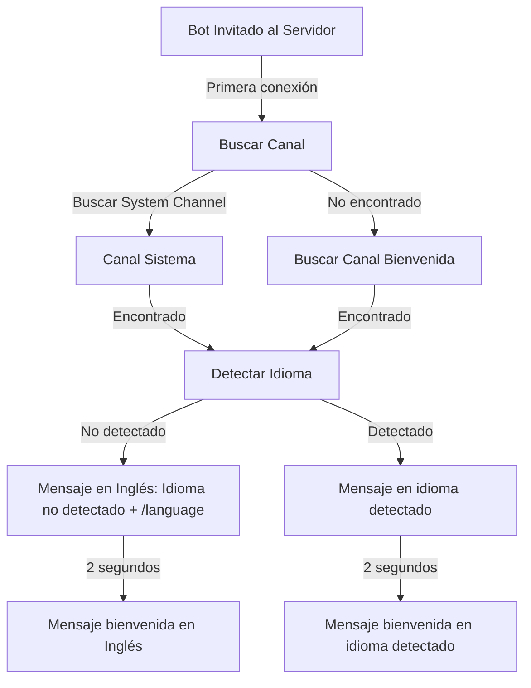
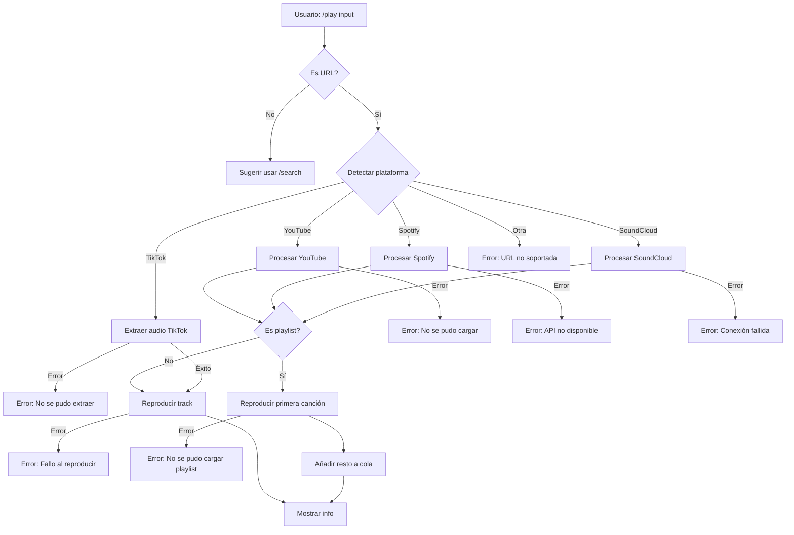
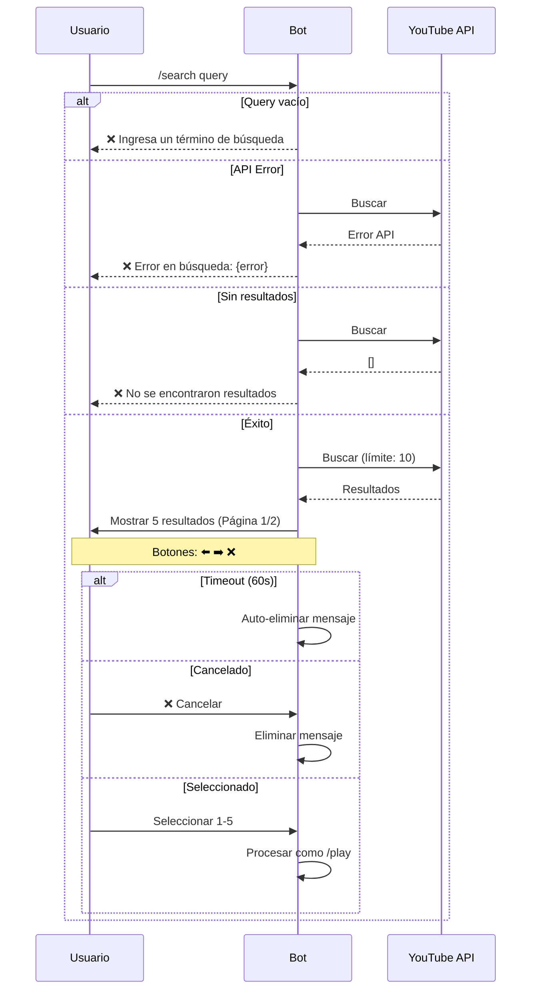
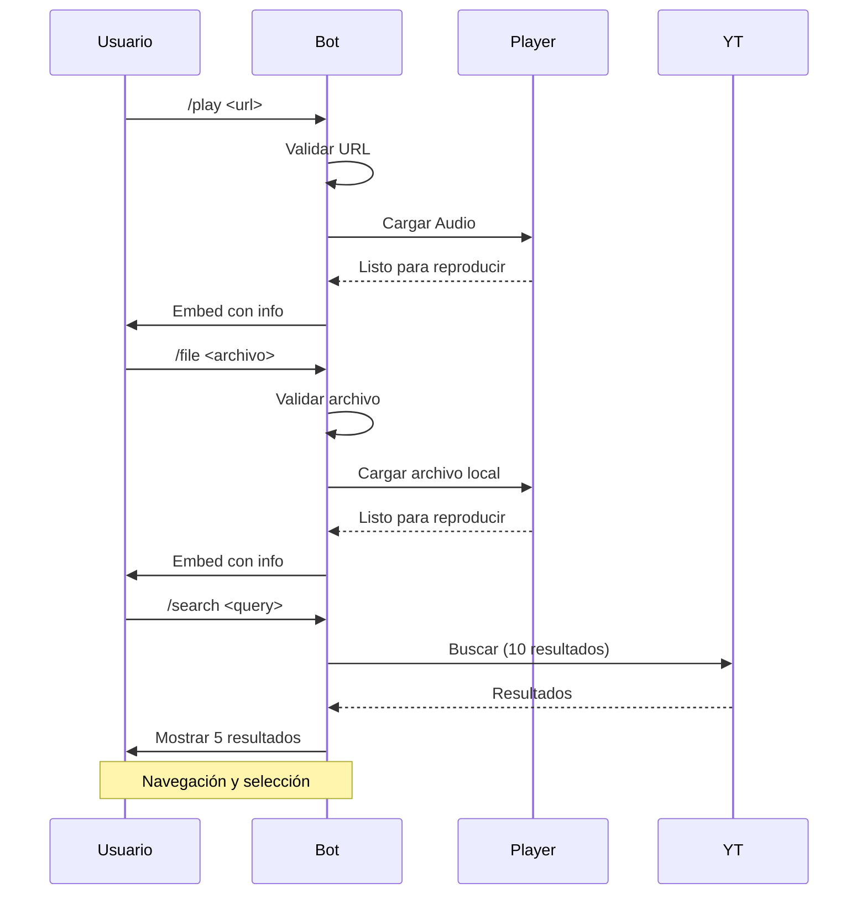
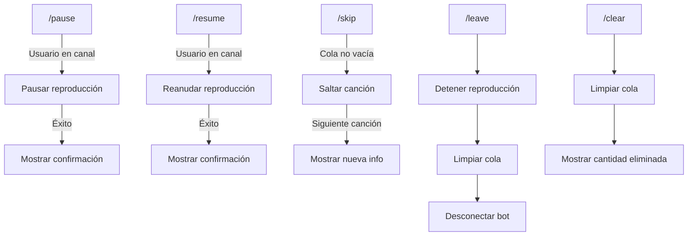
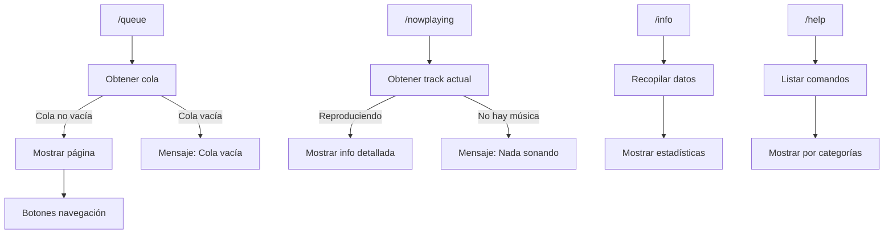
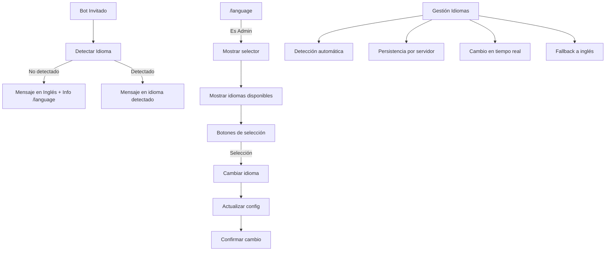
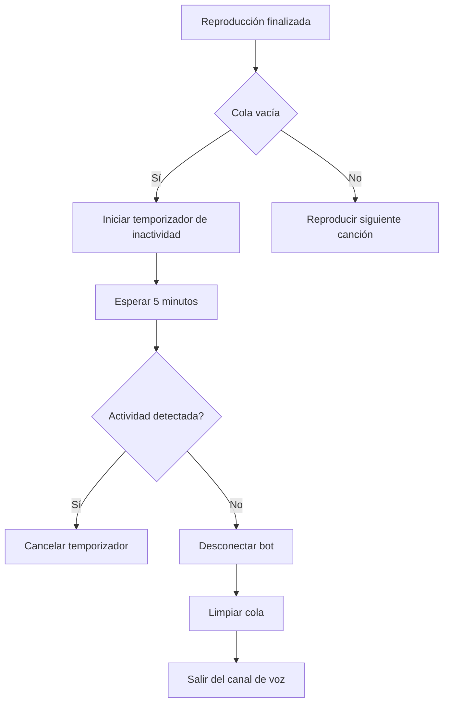

# 🎵 TuneTwister
Bot de música para Discord con sistema multiidioma avanzado y arquitectura moderna.

## 📊 Flujos del Sistema

### Proceso de Inicio


### Comando /play


### Comando /search


### Comandos de Reproducción


### Comandos de Control


### Comandos de Información


### Sistema de Idiomas


### Desconexión por Inactividad


### 🌐 Sistema de Idiomas
- **Características**
  - Detección automática al unirse al servidor
  - 35 idiomas soportados
  - Sistema de fallback a inglés
  - Persistencia de configuración
  - Cambio en tiempo real
  - Solo administradores pueden cambiar el idioma

- **Comando `/language`**
  - Uso: `/language`
  - Requiere permisos de administrador
  - Muestra selector con banderas
  - Cambio inmediato sin reinicio
  - Mensaje de confirmación en nuevo idioma

- **Idiomas Soportados**
  ```
  • 32 idiomas oficiales Discord
  • 3 idiomas regionales españoles (Català, Euskara, Galego)
  • Detección automática del idioma del servidor
  • Traducciones verificadas por la comunidad
  ```

### 🌍 Idiomas Disponibles
El bot está disponible en los siguientes idiomas:

#### Oficiales de Discord
| Idioma              | Código  | País/Región         | Bandera |
|---------------------|---------|---------------------|---------|
| Español             | es-ES   | España              | 🇪🇸      |
| English (UK)        | en-GB   | Reino Unido         | 🇬🇧      |
| English (US)        | en-US   | Estados Unidos      | 🇺🇸      |
| Español (LATAM)     | es-419  | Latinoamérica       | 🇲🇽      |
| Français            | fr      | Francia             | 🇫🇷      |
| Deutsch             | de      | Alemania            | 🇩🇪      |
| Italiano            | it      | Italia              | 🇮🇹      |
| Português (BR)      | pt-BR   | Brasil              | 🇧🇷      |
| Polski              | pl      | Polonia             | 🇵🇱      |
| Русский             | ru      | Rusia               | 🇷🇺      |
| Українська          | uk      | Ucrania             | 🇺🇦      |
| Nederlands          | nl      | Países Bajos        | 🇳🇱      |
| 日本語               | ja      | Japón               | 🇯🇵      |
| 한국어               | ko      | Corea del Sur       | 🇰🇷      |
| 中文                 | zh-CN   | China               | 🇨🇳      |
| 繁體中文             | zh-TW   | Taiwán              | 🇹🇼      |
| Türkçe              | tr      | Turquía             | 🇹🇷      |
| Magyar              | hu      | Hungría             | 🇭🇺      |
| Čeština             | cs      | República Checa     | 🇨🇿      |
| Ελληνικά            | el      | Grecia              | 🇬🇷      |
| Dansk               | da      | Dinamarca           | 🇩🇰      |
| Română              | ro      | Rumanía             | 🇷🇴      |
| Tiếng Việt          | vi      | Vietnam             | 🇻🇳      |
| Svenska             | sv-SE   | Suecia              | 🇸🇪      |
| ไทย                 | th      | Tailandia           | 🇹🇭      |
| Bahasa              | id      | Indonesia           | 🇮🇩      |
| Hrvatski            | hr      | Croacia             | 🇭🇷      |
| български           | bg      | Bulgaria            | 🇧🇬      |
| Lietuvių            | lt      | Lituania            | 🇱🇹      |
| हिन्दी              | hi      | India               | 🇮🇳      |
| Suomi               | fi      | Finlandia           | 🇫🇮      |
| Norsk               | no      | Noruega             | 🇳🇴      |

#### Regionales de España
| Idioma  | Código | Región    | Bandera |
|---------|--------|-----------|---------|
| Català  | ca-ES  | Catalunya | 🏴      |
| Euskara | eu-ES  | Euskadi   | 🏴      |
| Galego  | gl-ES  | Galicia   | 🏴      |

## ✨ Características Completas

### 🎵 Sistema de Música
- **Reproducción**
  - Múltiples fuentes soportadas:
    - YouTube (videos y playlists)
    - Spotify (tracks y playlists)
    - SoundCloud (tracks y playlists)
    - TikTok (audio de videos)
    - Archivos locales (mp3, wav, ogg)
  - Auto-reconexión si hay error
  - Sistema anti-crash integrado

- **Búsqueda**
  - Sistema de paginación (5 resultados por página)
  - Navegación con botones ⬅️ ➡️
  - Tiempo de espera: 60 segundos
  - Cancelación manual ❌
  - Auto-eliminación tras timeout

## 🔧 Comandos Disponibles

### Comandos de Música
| Comando | Descripción | Uso |
|---------|-------------|-----|
| `/play` | Reproduce desde URL | `/play <url>` |
| `/file` | Reproduce archivo local | `/file <adjunto>` |
| `/search` | Búsqueda en YouTube | `/search <query>` |
| `/pause` | Pausa la reproducción | `/pause` |
| `/resume` | Reanuda la reproducción | `/resume` |
| `/skip` | Salta a siguiente canción | `/skip` |
| `/leave` | Desconecta el bot | `/leave` |
| `/clear` | Limpia la cola | `/clear` |
| `/queue` | Muestra la cola | `/queue` |
| `/nowplaying` | Muestra canción actual | `/nowplaying` |

### Comandos de Sistema
| Comando | Descripción | Uso |
|---------|-------------|-----|
| `/help` | Muestra los comandos | `/help` |
| `/info` | Información del bot | `/info` |
| `/ping` | Muestra la latencia | `/ping` |
| `/test` | Prueba el sistema | `/test` |
| `/language` | Cambiar idioma (Admin) | `/language` |

### 🌐 Sistema Multiidioma
- **Idiomas Soportados**
  - 32 idiomas oficiales de Discord
  - 3 idiomas regionales españoles
  - Sistema de fallback inteligente

- **Gestión de Idiomas**
  - Detección automática
  - Persistencia por servidor
  - Cambio en tiempo real
  - Traducciones contextuales

### ⚙️ Sistema de Control
- **Controles de Música**
  ```
  Botones interactivos:
  ▶️ - Reproducir/Reanudar
  ⏸️ - Pausar
  ⏹️ - Detener
  ⏭️ - Siguiente
  ❌ - Desconectar bot
  ```

### 📊 Monitorización
- **Sistema de Logs**
  - Registro detallado
  - Rotación de archivos
  - Niveles de log configurables

- **Diagnósticos**
  ```
  /ping    - Verificar latencia
  /status  - Estado del sistema
  ```

## 📚 Documentación Completa

### 🎵 Comandos de Música
- **`/play <url>`**
  - Soporta múltiples plataformas:
    - YouTube (videos y playlists)
    - Spotify (tracks y playlists)
    - TikTok (audio de videos)
    - SoundCloud (tracks y playlists)
    - Tidal
    - Deezer
  - Detecta automáticamente el tipo de contenido
  - Reproduce la primera canción al instante
  - Añade el resto a la cola si es playlist
  - Manejo de errores robusto
  - Soporte para streams en vivo

- **`/search <query>`**
  - Busca hasta 10 resultados en YouTube
  - Muestra para cada resultado:
    - Título completo
    - Duración exacta
    - Nombre del canal
    - Vistas y fecha
  - 60 segundos para seleccionar
  - Selección mediante números (1-10)
  - Se procesa como `/play` tras seleccionar

### 🎚️ Control de Reproducción
- **`/pause`**, **`/resume`**
  - Pausa/reanuda la reproducción actual
  - Mantiene la posición exacta
  - Retiene la cola completa

- **`/stop`**
  - Detiene la reproducción actual
  - Limpia la cola de reproducción
  - Desconecta después de 5 minutos de inactividad

- **`/skip`**
  - Salta a la siguiente canción en cola
  - Muestra información de la nueva pista
  - Aviso si la cola está vacía

- **`/queue`**
  - Vista paginada (10 canciones por página)
  - Muestra para cada canción:
    - Posición en cola
    - Título y duración
    - Solicitante
  - Tiempo total restante
  - Botones de navegación entre páginas

### ⚙️ Configuración Avanzada
- **Variables de Entorno**
  ```env
  BOT_TOKEN=token_discord
  YOUTUBE_API_KEY=api_key
  SPOTIFY_CLIENT_ID=spotify_id
  SPOTIFY_CLIENT_SECRET=spotify_secret
  DEFAULT_LANGUAGE=es-ES
  LOG_LEVEL=INFO
  ```

- **Archivos de Configuración**
  ```
  /config/
    ├── guild_languages.json  # Configuración de idiomas
    ├── permissions.json      # Permisos personalizados
    ├── queue_cache.json     # Cache de colas
    └── settings.json        # Configuración general
  ```

- **Sistema de Logs**
  ```
  /logs/
    ├── bot.log             # Log principal
    ├── commands.log        # Registro de comandos
    ├── music.log          # Registro de reproducciones
    ├── errors.log         # Registro de errores
    └── debug.log          # Información de depuración
  ```

## 📦 Instalación

```bash
git clone https://github.com/Jaie55/TuneTwister.git
cd TuneTwister
mvn clean install
java -jar target/TuneTwister.jar
```

## 🤝 Contribuir

1. Fork el repositorio
2. Crea una rama (`git checkout -b feature/mejora`)
3. Commit tus cambios (`git commit -am 'Add: nueva característica'`)
4. Push a la rama (`git push origin feature/mejora`)
5. Abre un Pull Request

## 📜 Licencia

Este proyecto está licenciado bajo MIT - ver el archivo [LICENSE](LICENSE) para más detalles.

## 👥 Créditos

Desarrollado por Raw Community - Jaie55

## 📞 Soporte

- [Discord](https://discord.gg/zPQb6vnXhn)

